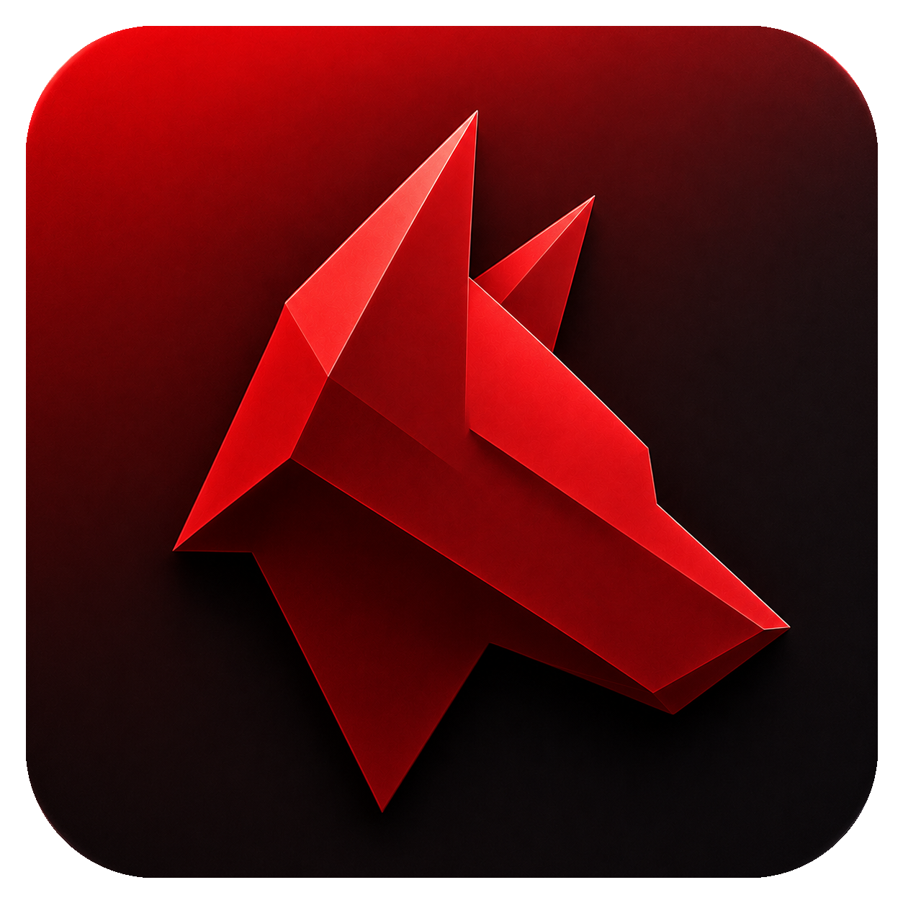

<p align="center">
  
</p>

<h1 align="center">📦 Lobrecs Agent</h1>

<p align="center">
  <strong>A local orchestrator and harness for multiple AI coding agents (Claude Code, Codex CLI, OpenCode).</strong>
</p>

<p align="center">
  <a href="https://github.com/oliveirabalsa/lobrecs-agent/releases">
    
  </a>
  <a href="#">
    
  </a>
</p>

Lobrecs Agent is a powerful desktop application built with Electron, React, and TypeScript. It acts as a local harness for orchestrating multiple AI coding agents, dynamically routing tasks based on complexity and managing localized git-isolated workspaces.

---

## 🚀 Releases & Updates

Production downloads, installable assets (DMG, ZIP, exe, AppImage, deb), and change histories are published directly to the repository releases page:

👉 **[Download & Releases Repository](https://github.com/oliveirabalsa/lobrecs-agent/releases)**

### How Auto-Updates Work
Lobrecs Agent uses `electron-updater` to keep instances current:
1. The app periodically checks for updates against the repository's public releases feed.
2. If a newer version is found, a subtle update banner appears in the application UI, and the assets download in the background.
3. The user is prompted to click **Restart to update** to apply the release when convenient. Squirrel.Mac validates code signing and notarization certificates for macOS updates to ensure integrity.

---

## 🛠 Tech Stack

- **Shell**: [Electron 33+](https://www.electronjs.org/) with secure `contextIsolation` enabled.
- **Frontend**: [React 19](https://react.dev/), [TypeScript](https://www.typescriptlang.org/) (strict mode), and [Tailwind CSS v4](https://tailwindcss.com/).
- **Database**: SQLite locally powered by [better-sqlite3](https://github.com/WiseLibs/better-sqlite3) for session logs and configuration persistence.
- **Terminal Integration**: `xterm.js` and `node-pty` for real-time streaming of local agent executions.
- **Diff Engine**: Monaco Editor for precise interactive diff review before code ingestion.

---

## 🏁 Getting Started

### Prerequisites
- [Node.js](https://nodejs.org/) (v18 or higher recommended)
- `npm` (packaged with Node.js)

### Installation
Clone the repository and install all dependencies:
```bash
git clone https://github.com/oliveirabalsa/lobrecs-agent.git
cd lobrecs-agent
npm install
```

### Running Locally
To launch the app in development mode with hot-reloading:
```bash
npm run dev
```

### Running Tests
Execute unit tests using [Vitest](https://vitest.dev/):
```bash
npm test
```

### Building & Type Checking
To run TypeScript compilation/checks and generate build assets:
```bash
npm run build
```

---

## 📦 Releasing a New Version

The release process is automated using a local release script ([scripts/release.mjs](file:///Users/leonardooliveirabalsalobre/Documents/projects/lobrecs-agent/scripts/release.mjs)).

### Release Commands

| Command | Action |
| :--- | :--- |
| `npm run release` | Increments version (patch), validates environment, builds, notarizes, and publishes macOS DMG/ZIP locally. |
| `npm run release:ci` | **(Recommended)** Bumps version, pushes a git tag (`v*`), and lets GitHub Actions build, sign, and release macOS, Windows, and Linux packages. |
| `npm run release:minor` | Increments minor version (e.g., `0.1.2` ➔ `0.2.0`). |
| `npm run release:major` | Increments major version (e.g., `0.1.2` ➔ `1.0.0`). |
| `npm run release -- --local` | Performs a local unsigned macOS package build only (no tags, no uploads). |

### Prerequisites for Publishing Releases
1. **Git State**: Your working directory must be clean, you must be on `main`, and your branch must be up-to-date with `origin/main`.
2. **GitHub Auth**: Either a `GH_TOKEN` / `GITHUB_TOKEN` must be present in the shell environment, or the GitHub CLI (`gh`) must be logged in.
3. **macOS Developer Certificates** (for local signed builds): Appropriate Developer ID Application certificates must be installed in the macOS Keychain, alongside Apple API API credentials for Notarization.

---

## 📂 Project Structure & Documentation

For details on the architecture design, codebase modularity, styling conventions, or agent coding checklists, refer to the guides below:

- 📖 **[Developer Documentation Index](file:///Users/leonardooliveirabalsalobre/Documents/projects/lobrecs-agent/docs/README.md)** — Start here for the architecture map and coding guidelines.
- 🤖 **[AGENTS.md](file:///Users/leonardooliveirabalsalobre/Documents/projects/lobrecs-agent/AGENTS.md)** — Core rules, stacks, and directory guidelines for AI agents working in this repository.
